## Overview

This tutorial explains how to interface ROS2 with PX4 (SITL) using DDS.

### Prerequisites

   * [ROS2 Installed](https://docs.px4.io/main/en/ros/ros2_comm.html#install-ros-2), and setup for your operating system (e.g. [Linux Ubuntu](https://docs.px4.io/main/en/dev_setup/dev_env_linux_ubuntu.html)) with Gazebo
   * [FastDDS Installed](https://docs.px4.io/main/en/dev_setup/fast-dds-installation.html)
   * [PX4-Autopilot downloaded](https://docs.px4.io/main/en/dev_setup/building_px4.html)
   * [QGroundControl installed](https://docs.qgroundcontrol.com/master/en/getting_started/download_and_install.html)

### Example System Details

  * Ubuntu 22.02
  * ROS2 Humble
  * Python 3.10

## Install PX4 Offboard and dependencies (one time setup)

### Install the px4-offboard example from Jaeyoung-Lim

```
cd ~
git clone https://github.com/Jaeyoung-Lim/px4-offboard.git
```

### Install PX4 ROS Com and PX4 msg

The `px4-offboard` example requires the `px4_ros_com` bridge and `px4_msgs` definitions:

```
cd ~
mkdir px4_ros_com_ws
cd px4_ros_com_ws
git clone https://github.com/PX4/px4_ros_com.git
git clone https://github.com/PX4/px4_msgs.git
```


Build them:


```
colcon build
```

This should build, and you may see some warnings:

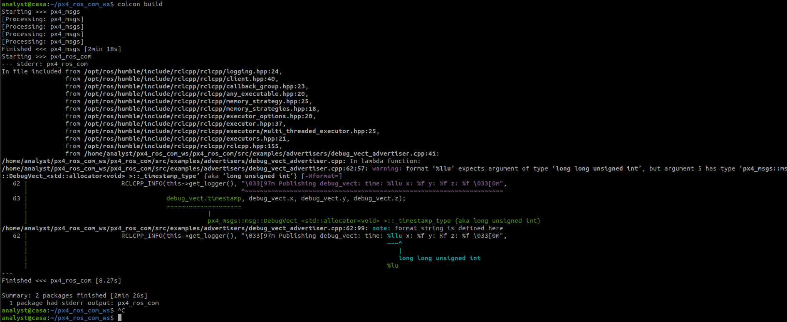

As long as there are no __*errors*__ you should be OK..

## Install the micro_ros_agent  (one time setup)

#### Check ROS Distro

When building micro_ros_agent, you need to build it for the particular ROS version you are using.  

Ensure your ROS_DISTRO environment variable is set

```
env | grep ROS
```

You should see this variable with some other ROS settings:

```
ROS_DISTRO=humble
```

If it's not set you can try to update:

```
export ROS_DISTRO=humble
```


*Note: If the ROS_DISTRO isn't set in your enviornment you probably don't have a clean ROS2 installation.  You may have issues with the rest of this tutorial.  Recommend reinstalling and checking your ROS2 installation*


#### Building the micro_ros_agent

From:  [Building micro-ROS-Agent](https://github.com/micro-ROS/micro_ros_setup#building-micro-ros-agent)

```
cd ~
mkdir ~/microros_ws
cd microros_ws
git clone -b $ROS_DISTRO https://github.com/micro-ROS/micro_ros_setup.git 
mkdir src
mv micro_ros_setup/ src/
colcon build
source install/local_setup.sh
ros2 run micro_ros_setup create_agent_ws.sh
ros2 run micro_ros_setup build_agent.sh
```
*Note how the ROS_DISTRO environment variable is used to specify the correct branch...

This should build and may flash a few warnings:

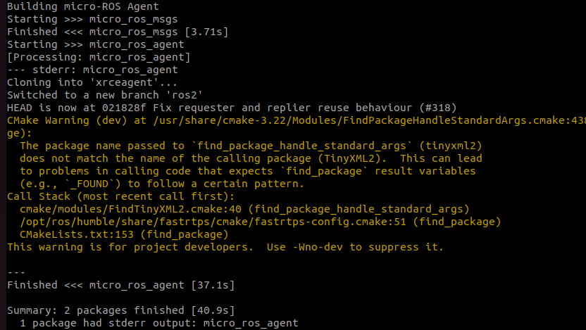

Try running the agent:

```
source install/local_setup.sh
ros2 run micro_ros_agent micro_ros_agent udp4 --port 8888
```

It should respond with:

```
[1670101284.566587] info     | UDPv4AgentLinux.cpp | init                     | running...             | port: 8888
[1670101284.566822] info     | Root.cpp           | set_verbose_level        | logger setup           | verbose_level: 4
```

## Run the Demo

### Overview

You will need 4 terminal windows  ([gnome terminator](https://gnome-terminator.org/) is a great for this!), one for each of the following components:

   * micro-ros-agent
   * Gazebo   
   * px4-offboard example
   * QGroundControl

In each terminal window, we will first source any workspace settings required for a particular component and also set the `ROS_DOMAIN_ID` and `PYTHONOPTIMIZE`  in each window

### Start the micro-ros-agent

```
cd ~/microros_ws
export ROS_DOMAIN_ID=0
export PYTHONOPTIMIZE=1
ros2 run micro_ros_agent micro_ros_agent udp4 --port 8888 ROS_DOMAIN_ID=0
```

This should start with a few initial messages:

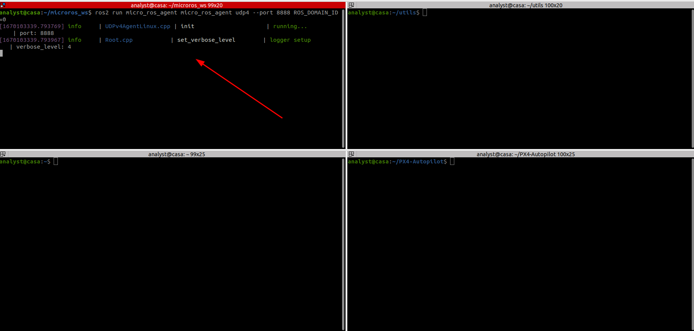

### Start Gazebo

```
cd ~/PX4-Autopilot
export ROS_DOMAIN_ID=0
export PYTHONOPTIMIZE=1
make px4_sitl gazebo
```

Gazebo should start and you should see the Micro ROS Agent start to receive DDS messages:

![[Pasted image 20221203164029.png]]

Leave the agent running for the rest of the tutorial

If you scroll up in the Gazebo window, you should also see it sending microDDS messages:

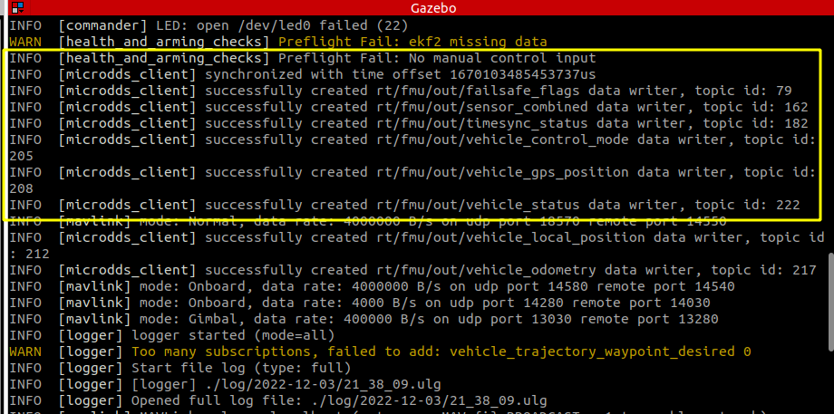


### Start QGround Controller and Take Off

In the QGroundControl terminal, launch the app:

```
./QGroundControl.AppImage
```

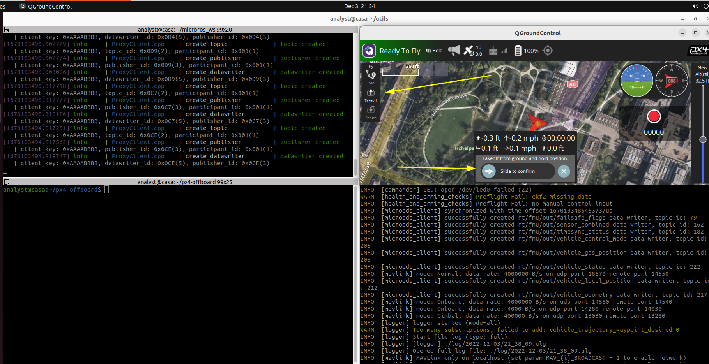

The simulated drone should takeoff and climb to an altitude of 10m (~32ft)


### Start the px4-offboard example

#### Check ROS Messages

Before we start the example, lets check ROS2 topics:

```
cd ~/px4-offboard
export ROS_DOMAIN_ID=0
export PYTHONOPTIMIZE=1
ros2 topic list
```

You should see a list of topics that match the ones sent from Gazebo.:

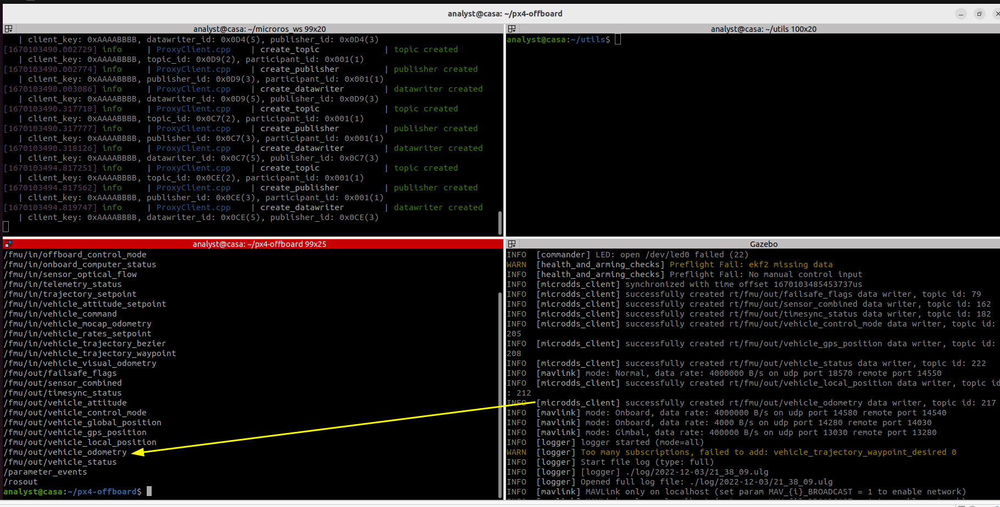

If you do not see the topics:

  * Check that `ROS_DOMAIN_ID=0`  in all the terminals

Let's echo a  topic:

```
ros2 topic echo /fmu/out/vehicle_odometry
```

The terminal should echo some rapidly updating details about the simulated drone.  If you look at position, you can see it matches the height of our drone

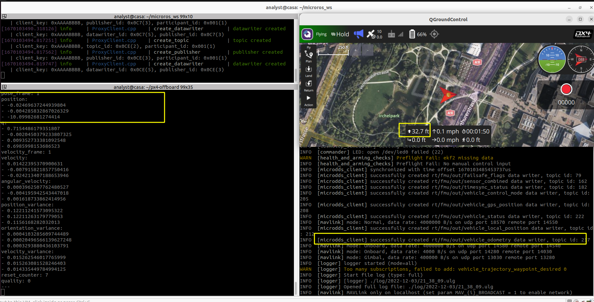

Now that we verfied the DDS-ROS subscription comms, we can start the demo

CTRL-C to stop the topic echo and then:

```
source ../px4_ros_com_ws/install/setup.bash
source install/setup.bash
```

The first source ensures the dependencies are loaded for the demo.
The second is for the demo itself.

Now launch the demo:

```
ros2 launch px4_offboard offboard_position_control.launch.py
```

If things work, the demo should immediately show an RViz window with the drone at altitude:

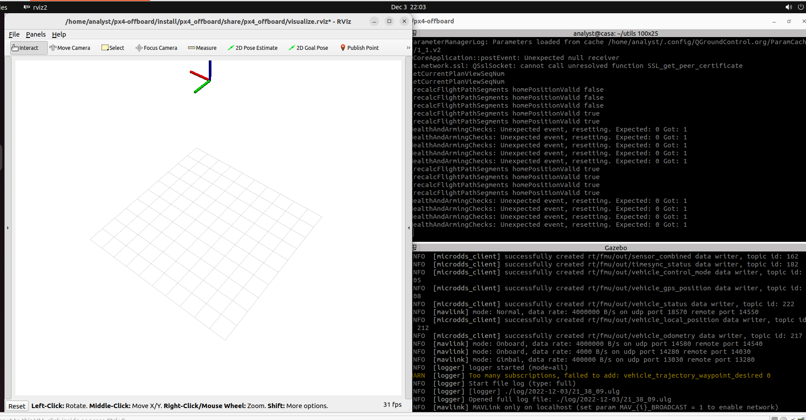

Now head back to QGroundControl and enable offboard control.  Click the current mode:

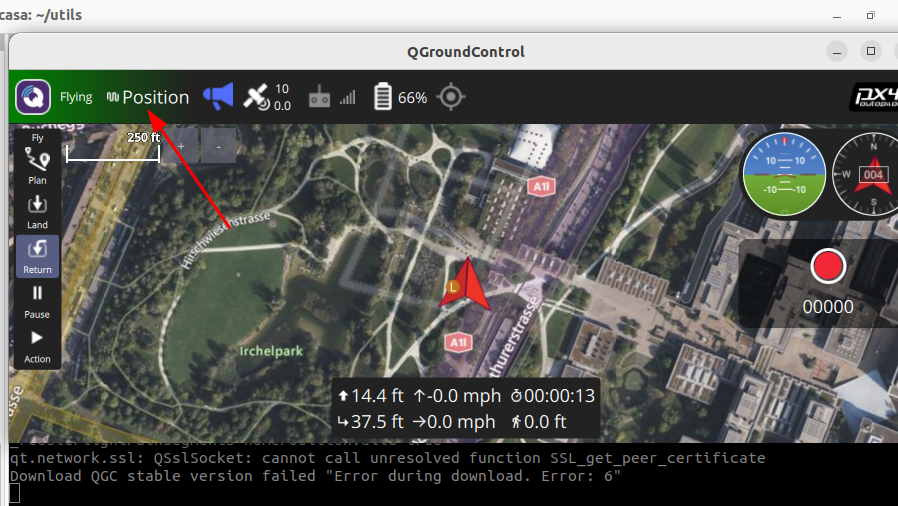

Then, in the menu, select `Offboard`:

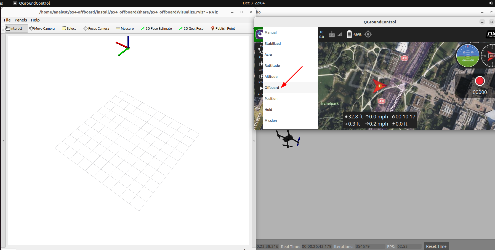

After a 1-2 sec pause, the demo should take control:

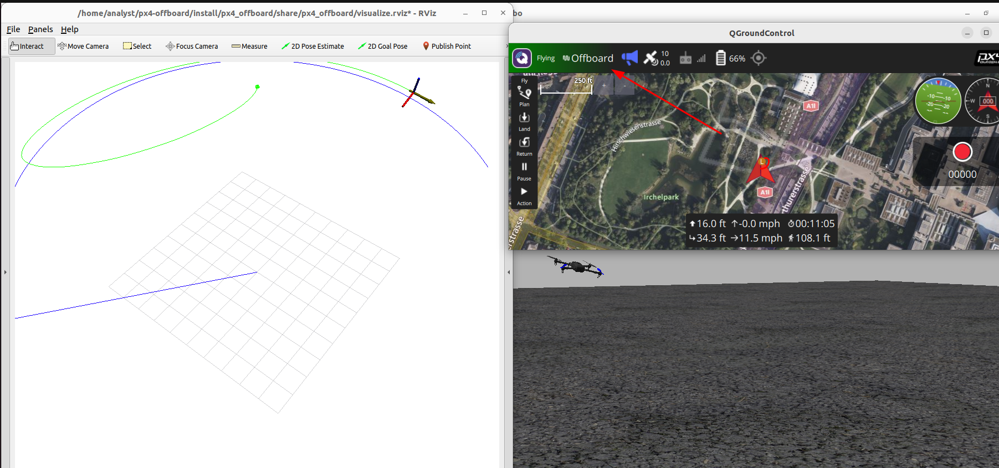

